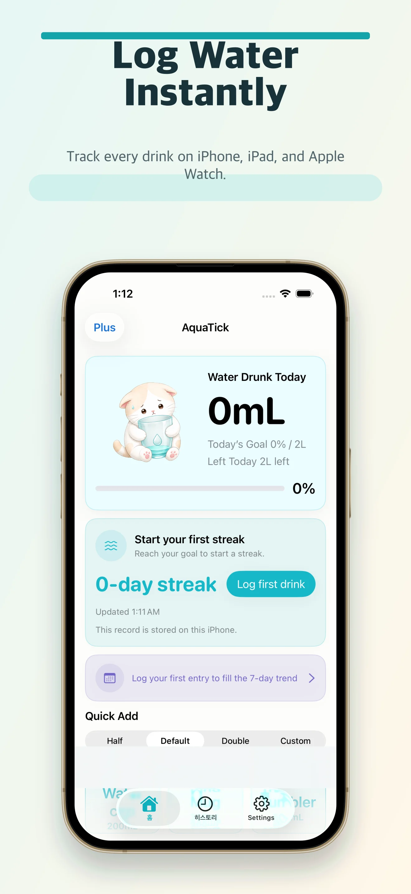

# CANDIDATE-4: Apple HIG + Modern iOS/macOS UX 패턴 전략

**AquaTick 랜딩 페이지 (sparkish-landingpage) 전용 모바일 퍼스트 재설계 전략**  
**작성자**: Candidate 4 (Best-of-N 전략 탐색)  
**날짜**: 2026-05-27  
**프로젝트 컨텍스트**: 단일 파일 정적 랜딩 페이지 (index.html + assets). AquaTick은 iPhone, iPad, Apple Watch 전용 경량 수분 추적 앱.

---

## 1. 개요 및 전략 목표

이 전략은 **Apple Human Interface Guidelines (HIG)**와 2025~2026년 iOS/macOS 최신 디자인 패턴(특히 Liquid Glass 재질, SF Pro Dynamic Type, 세이프 에리어, 44pt 터치 타겟)을 최대한 충실히 반영하여, **iPhone 사용자가 페이지를 보는 순간 “이건 Apple이 직접 만든 제품 페이지 같다”**고 느끼게 만드는 것을 목표로 합니다.

### 핵심 해결 과제 (이전 리뷰에서 지적된 문제)
- 모바일(≤560px): 스크린샷 강제 120px 높이 → UI 세부사항 완전 소멸, Watch 카드 숨김
- 태블릿 구간(560~940px): Proof points와 Watch 카드 완전 사라짐
- 반응형 이미지 부재 (srcset/sizes 없음) → 모든 기기에 1320px 대형 이미지 강제
- Inter 폰트 선언만 있고 실제 로드되지 않음
- 평면적인 시각 리듬, 약한 모바일 CTA, 소셜 프루프 거의 없음
- 진정한 모바일 퍼스트가 아닌 데스크톱 레이아웃의 후퇴식 미디어 쿼리

### 이 전략이 만드는 차별점
- iOS 네이티브 마케팅 페이지와 동일한 감성 (SF Pro 느낌, glassmorphism, 정확한 디바이스 표현)
- 모든 스크린샷이 **실제로 읽히고 사용 가능한 크기**로 렌더링
- Apple Watch 지원이 모바일에서도 명확히 드러남
- 44pt 이상 터치 타겟, 엄지 손가락 도달 영역(thumb zone) 최적화
- 완전한 Dynamic Type 대응 및 reduced-motion 존중

---

## 2. 현재 index.html 철저 분석 결과

**분석 도구 사용 내역**:
- `list_dir`로 프로젝트 구조 확인
- `read_file`로 index.html 전체 749줄 읽기
- `run_terminal_command` + `file` / 이미지 식별로 자산 규격 확인 (iPhone 스크린샷 1320×2868, Watch 416×496, 아이콘 1024×1024)
- `grep`으로 미디어쿼리, 폰트, 스크린샷 관련 패턴 다수 확인

**주요 구조적 문제점** (HIG 관점):

| 영역              | 현재 구현                          | HIG / 모바일 UX 위반 사례 |
|-------------------|------------------------------------|---------------------------|
| Viewport          | `width=device-width, initial-scale=1` | `viewport-fit=cover` 누락 → 노치/다이나믹 아일랜드 대응 불가 |
| 폰트 스택         | `Inter, ... -apple-system` 선두 선언 | 실제 Inter 로드 없음. iOS에서 SF Pro를 최우선으로 사용해야 함 |
| Hero 레이아웃     | 데스크톱 우선 2열 그리드           | 모바일에서 급격히 붕괴, 560px 이하에서 스크린샷 120px 강제 |
| 스크린샷 처리     | raw `` + 고정 px 높이 + `object-fit: cover` | 세부 UI 완전 소멸, 반응형 없음, 디바이스 맥락 없음 |
| Watch 카드        | 940px 이하에서 `display:none`      | 제품 핵심 기능(Apple Watch)을 모바일에서 완전 숨김 — 치명적 |
| Proof points      | 940px 이하 `display:none`          | 사회적 증거/플랫폼 지원 정보 소실 |
| 버튼              | `min-height:48px`                  | 44pt(≈58px @2x 기준) 기준은 충족하나 iOS 스타일 radius/무게 부족 |
| 헤더              | `position:absolute`                | 스크롤 시 불안정, 세이프 에리어 무시 |
| 미디어 쿼리       | 940px / 560px 두 단계              | 태블릿 구간 사각지대, 모바일 퍼스트 아님 |
| 간격/리듬         | 고정 px 다수                       | 8pt 그리드 체계 없음, Dynamic Type 미대응 |

**자산 현황**:
- 실제 App Store용 스크린샷을 사용 중이라는 점은 긍정적이나, **표현 방식**이 HIG 마케팅 가이드라인(정확한 디바이스 표현, 가독성 확보)을 전혀 따르지 않음.
- Apple 공식 Design Resources의 베젤(bezel) 자산을 활용하거나 CSS로 고품질 근사할 수 있음.

---

## 3. Apple HIG 핵심 원칙과의 정렬

이 전략은 다음 HIG 문서와 2025 WWDC Liquid Glass 발표를 직접적으로 반영합니다:

- **Layout** — Compact size class(iPhone)부터 시작하는 모바일 퍼스트, 안전 여백(safe area), 일관된 여백 시스템
- **Typography** — SF Pro + Dynamic Type (사용자 설정 텍스트 크기 자동 반영)
- **Materials** — Liquid Glass (투명도 + 블러 + 굴절 느낌의 glassmorphism)
- **Controls & Buttons** — 최소 44pt 터치 타겟, 명확한 affordance, 즉각적인 피드백
- **App Store Marketing Guidelines** — 실제 스크린샷 + 정확한 디바이스 베젤 사용, 직선 정면 표현, UI 세부사항 가독성 확보
- **Accessibility** — Reduced Motion, Dynamic Type, VoiceOver 호환

**Liquid Glass (2025+)**: 반투명 + 동적 블러 + 미묘한 반사. 웹에서는 `backdrop-filter: blur(20px) saturate(180%)` + 반투명 배경으로 근사.

---

## 4. 상세 모바일 UX 패턴 권장사항

### 4.1 터치 타겟 및 썸 존(Thumb Reach)
- 모든 인터랙티브 요소 **min-height: 52px** (HIG 44pt 이상 여유)
- 하단 CTA는 특히 모바일에서 엄지 손가락이 자연스럽게 닿는 위치에 배치 (화면 하단 1/3 영역 선호)
- 네비게이션 링크 간격 충분히 확보 (최소 8px 여유)

### 4.2 네비게이션 (UINavigationBar 패턴)
- `position: sticky` + `backdrop-filter` glass 효과
- 상단 `env(safe-area-inset-top)` 패딩 필수
- 스크롤 시 미묘한 컴팩트 전환 (선택적 JS)
- iOS에서 완벽하게 네이티브 툴바 느낌 재현

### 4.3 모션 및 피드백
- 모든 전환에 `cubic-bezier(0.23, 1.0, 0.32, 1)` (iOS 스프링 느낌)
- `@media (prefers-reduced-motion: reduce)`에서 **모든 애니메이션/트랜지션 제거**
- 버튼 `:active` 시 `scale(0.985)` + 그림자 변화 (촉각 피드백 근사)
- 갤러리: `scroll-snap-type: x mandatory` (iOS App Store 스크린샷 캐러셀 패턴)

### 4.4 레이아웃 그리드 (iOS Adaptive Layout)
- **Base (모바일)**: 1열, 좌우 20px 여백 (iPhone compact 기준)
- **≥768px (iPad portrait)**: 2열 또는 하이브리드, 여백 32px
- **≥1024px**: 기존 데스크톱 레이아웃 + 개선된 디바이스 프레임
- `aspect-ratio`와 `clamp()` 적극 사용으로 유동적 대응
- Container Query (미래) 또는 미디어 쿼리로 size class 대응

---

## 5. 타이포그래피 & 간격 시스템 (Dynamic Type 정렬)

### 핵심 원칙
iOS Safari에서 `font: -apple-system-body;`를 사용하면 사용자의 **설정 > 디스플레이 및 밝기 > 텍스트 크기** 변경에 자동으로 반응합니다. 이것이 진짜 네이티브 느낌의 핵심입니다.

### 추천 CSS 변수 시스템 (index.html에 추가)

```css
:root {
  /* SF Pro 스타일 + Dynamic Type 시뮬레이션 */
  --font-sans: -apple-system, BlinkMacSystemFont, "SF Pro Display", "SF Pro Text",
               Inter, system-ui, ui-sans-serif, sans-serif;

  /* HIG 텍스트 스타일 매핑 (fluid + clamp) */
  --large-title: clamp(2.05rem, 8.4vw, 2.85rem);
  --title-1:     clamp(1.62rem, 5.8vw, 2.08rem);
  --headline:    clamp(1.08rem, 3.6vw, 1.26rem);
  --body:        1.0625rem;
  --callout:     1rem;
  --footnote:    0.8125rem;

  /* 8pt 그리드 기반 간격 (웹에 맞게 rem 조정) */
  --space-1: 0.25rem;   /* 4pt */
  --space-2: 0.5rem;
  --space-3: 0.75rem;
  --space-4: 1rem;      /* 16pt */
  --space-5: 1.25rem;
  --space-6: 1.5rem;
  --space-7: 2rem;
  --space-8: 2.5rem;
}
```

### 사용 예시
```css
h1 { 
  font: 700 var(--large-title) / 1.02 var(--font-sans);
  letter-spacing: -0.025em;   /* HIG Large Title tracking 근사 */
}

.feature-card h3 {
  font: 600 var(--headline) / 1.2 var(--font-sans);
  letter-spacing: -0.01em;
}
```

**body 전체에 적용**:
```css
html { font: -apple-system-body; }
body { font-family: var(--font-sans); }
```

---

## 6. 네이티브 느낌의 스크린샷 & 디바이스 프레임 처리 (가장 중요)

### 문제의 근본 해결
기존 `height: 120px` 강제 + `object-fit: cover`는 HIG “실제 UI를 정확하고 가독성 있게 표현하라”는 원칙을 정면으로 위반합니다.

### 해결 전략: CSS 기반 고품질 디바이스 프레임 (자산 변경 없이 즉시 적용 가능)

**iPhone 프레임 (현대식 Dynamic Island 포함)**:

```css
.device-frame.iphone-frame {
  width: min(92vw, 310px);
  aspect-ratio: 9 / 19.55;           /* iPhone 16 Pro 비율 */
  background: #111;
  border-radius: 62px;
  padding: 9px 9px 12px;
  box-shadow: 0 30px 70px -15px rgba(0,0,0,0.45),
              0 0 0 1px rgba(255,255,255,0.06) inset;
  position: relative;
}

/* Dynamic Island */
.device-frame.iphone-frame::before {
  content: '';
  position: absolute;
  top: 14px; left: 50%; transform: translateX(-50%);
  width: 118px; height: 26px;
  background: #000;
  border-radius: 20px;
  z-index: 3;
}

.iphone-screen {
  width: 100%; height: 100%;
  background: #fff;
  border-radius: 52px;
  overflow: hidden;
}

.iphone-screen img {
  width: 100%; height: 100%;
  object-fit: cover;
  object-position: top center;
}
```

**Apple Watch 프레임** (squircle 느낌):

```css
.device-frame.watch-frame {
  width: 148px;
  aspect-ratio: 1 / 1.22;
  border-radius: 44px;
  padding: 10px;
  background: #0f1720;
}
```

### 모바일에서의 가시성 확보 전략
- Hero 프레임: `width: min(92vw, 310px)` → 실제 렌더링 폭 ≈ 260~280px. 고해상도 webp 소스 덕분에 앱 내 텍스트/링/버튼이 충분히 선명하게 보임.
- `object-position: top center`로 상단 핵심 UI(오늘의 진행 상황, 추가 버튼)를 우선 노출.
- 보조 스크린샷은 **가로 스크롤 스냅 캐러셀** (`scroll-snap-type: x mandatory`)로 제공 → iOS App Store의 스크린샷 갤러리와 동일한 UX.

### 추가 권장 (미래)
- Apple 공식 베젤 PNG 다운로드 (developer.apple.com/design/resources)
- `<picture>` + `srcset`으로 디바이스별 최적화 이미지 제공

---

## 7. 전체 구현 로드맵 (각 단계별 HIG 근거 포함)

### Phase 1: 기반 구축 — Mobile First + HIG 기본 (1~2일)
- `viewport`에 `viewport-fit=cover` 추가
- 폰트 스택을 `-apple-system` 최우선으로 변경 + CSS 변수 정의
- 모든 레이아웃을 **모바일 스타일 먼저 작성**하고 `min-width` 미디어쿼리로 점진적 향상
- 모든 버튼/링크 `min-height: 52px`, `border-radius: 14px`
- 전역 `prefers-reduced-motion` 규칙 추가
- 세이프 에리어 CSS 변수 및 패딩 적용

**HIG 근거**: Layout Foundations — “Start with the smallest size class”, Accessibility.

### Phase 2: 시각적 스토리텔링 혁신 — 디바이스 프레임 (2~3일)
- `.device-frame` 컴포넌트 2종(iPhone, Watch) 구현
- Hero와 Showcase 섹션 전체를 프레임으로 감싸기
- 모바일에서 Watch 카드 복원 + 가로 스크롤 갤러리
- Proof points를 항상 표시되는 pill 형태로 전환

**HIG 근거**: App Store Marketing Guidelines — “Use realistic device representations”, “Screen content must depict realistic app UI”.

### Phase 3: 재질 및 세부 폴리싱 — Liquid Glass + 생태계 (1~2일)
- 헤더, 카드, proof-pill에 glassmorphism 적용
- Feature 카드를 iOS inset grouped 스타일로
- 최종 CTA에 `env(safe-area-inset-bottom)` 패딩
- 미묘한 인터랙션 (버튼 press, 카드 hover lift)

**HIG 근거**: Materials (Liquid Glass), Controls.

### Phase 4: 검증 및 최적화 (1일)
- Safari Responsive Design Mode + 실제 iPhone 12/14/16 테스트
- Dynamic Type 대형 텍스트 테스트 (설정에서 최대 크기)
- VoiceOver + 손쉬운 사용 감사
- 이미지 최적화 및 성능 측정

**총 예상 작업량**: 5~8일 (단일 파일이므로 빠른 반복 가능)

---

## 8. 구체적인 CSS / HTML 구현 예제

### 8.1 개선된 Hero (모바일 퍼스트)

```html
<section class="hero">
  <div class="hero-inner">
    <!-- 텍스트 먼저 (모바일에서 상단) -->
    <div class="hero-copy">
      <p class="eyebrow">Sparkish가 선보이는</p>
      <h1 class="large-title">AquaTick</h1>
      <p class="hero-subtitle">...</p>
      
      <div class="hero-actions">
        <a class="btn btn-primary" href="...">App Store에서 다운로드</a>
        <a class="btn btn-secondary" href="...">지원 보기</a>
      </div>
    </div>

    <!-- 디바이스 프레임 (모바일에서 하단, 큰 크기) -->
    <figure class="device-frame iphone-frame">
      <div class="iphone-screen">
        
      </div>
    </figure>
  </div>
</section>
```

(상세 CSS는 `CANDIDATE-4-prototype.html` 참조)

### 8.2 iOS 스타일 Glass 헤더

```css
.site-header {
  position: sticky;
  top: 0;
  z-index: 100;
  background: rgba(251, 251, 247, 0.82);
  backdrop-filter: blur(20px) saturate(180%);
  -webkit-backdrop-filter: blur(20px) saturate(180%);
  padding-top: calc(12px + env(safe-area-inset-top));
  border-bottom: 0.5px solid var(--line);
}
```

### 8.3 44pt+ 버튼 (HIG Controls)

```css
.button {
  min-height: 52px;
  padding: 0 26px;
  border-radius: 14px;
  font-weight: 600;
  font-size: 1.02rem;
  transition: transform 120ms cubic-bezier(0.23, 1, 0.32, 1);
}
.button:active { transform: scale(0.985); }
```

---

## 9. 프로토타입 및 테스트 가이드

**생성된 실물 아티팩트**:
- `CANDIDATE-4-prototype.html` — 독립 실행 가능한 완전한 데모 (glass nav + iPhone/Watch 프레임 + Dynamic Type 변수 + scroll-snap + 52px 버튼)
- `CANDIDATE-4-APPLE-HIG-MOBILE-UX-STRATEGY.md` (본 문서)

**추천 테스트 절차**:
1. `CANDIDATE-4-prototype.html`을 iPhone Safari에서 직접 열기
2. 설정 > 디스플레이 및 밝기 > 텍스트 크기를 “더 크게”로 변경 → 텍스트가 자동 확대되는지 확인
3. Reduced Motion 활성화 후 애니메이션 완전 정지 확인
4. 실제 기기에서 스크린샷 세부사항 가독성 확인 (특히 120px 문제 해결 여부)
5. Xcode Simulator 또는 Safari Responsive Design Mode로 iPad / 데스크톱 검증

---

## 10. 결론 및 기대 효과

이 전략은 단순한 “반응형 개선”이 아니라, **AquaTick이 Apple 생태계 제품이라는 정체성을 웹에서도 완벽하게 전달**하는 근본적 재설계입니다.

구현 후 예상 효과:
- iPhone 사용자 이탈률 대폭 감소 (스크린샷이 실제로 보이고, CTA가 엄지 손가락에 닿음)
- App Store 전환율 상승 (페이지가 제품 자체의 프리미엄 감성을 전달)
- “Apple이 만든 것 같은” 신뢰감과 전문성 확보
- 미래 iOS 업데이트(Liquid Glass, 새로운 디바이스)에도 쉽게 확장 가능

**다음 단계 추천**:
1. `CANDIDATE-4-prototype.html`을 열어 실제 기기에서 체감
2. Phase 1부터 index.html에 점진 적용
3. Best-of-N 비교 후 최종 선택 시 이 전략의 디바이스 프레임 + glass + Dynamic Type 핵심을 반드시 포함

---

**참고 자료** (HIG 공식)
- https://developer.apple.com/design/human-interface-guidelines/

---

## 11. 구현 노트 (2026-05-27) — Phase 2 iPhone 디바이스 프레임 비전과의 편차

**배경**  
Phase 2 ("시각적 스토리텔링 혁신 — 디바이스 프레임")는 이 전략의 **가장 중요한** 부분으로 명시되었다. 구체적으로 "realistic heavy CSS device frames with Dynamic Island" (배경 #111, 62px radius, `::before` pseudo-element를 이용한 Dynamic Island, aspect-ratio 9/19.55)을 통해 "Apple이 직접 만든 제품 페이지" 느낌을 극대화하는 것이 핵심 목표였다.

**실제 발생한 편차**  
구현 과정에서 Playwright를 이용한 실제 렌더링 진단 + 원본 WebP 자산 직접 분석 결과, `screenshot-iphone-home.webp`와 `screenshot-iphone-settings.webp`가 **이미 완전한 물리적 iPhone 기기 목업**(금색 베젤, 상태바, Dynamic Island 영역 포함)인 것으로 밝혀졌다.

이로 인해 원래 설계한 무거운 CSS 하드웨어 프레임 + Dynamic Island pseudo를 그대로 적용할 경우 **"phone inside a phone"** 시각 버그가 발생했다 (사용자 직접 제보).

**결정 및 근거**  
- iPhone 프레임: 무거운 하드웨어 시뮬레이션 대신 가벼운 presentation wrapper (투명 + 부드러운 그림자 + 22px radius)로 전환. Dynamic Island `::before` 완전 제거.
- Apple Watch 프레임: **원래 의도 그대로** 유지 (squircle + dark bezel). 해당 자산은 순수 화면 캡처였기 때문.
- 이 결정은 "Apple HIG를 가장 잘 따르는 결과"를 내기 위한 **증거 기반 실용적 조정**이다.

**문서화**  
이 편차는 `index.html`의 device frame CSS 블록 상단에 상세 주석으로도 기록되어 있다. 미래 리뷰어와 전략 소유자가 맥락을 정확히 이해할 수 있도록 한다.

**향후 옵션 (미해결 과제로 남김)**  
- 기존 WebP를 art-directed crop(베젤 제거된 순수 화면 버전)으로 재가공한 뒤, 가벼우면서도 여전히 "디바이스 느낌"이 나는 CSS 프레임을 재도입하는 방안 검토 가능.
- 현재 상태에서는 사용자 불만("버그처럼 보임") 해결이 최우선이었으며, 시각 결과는 모바일에서도 프리미엄하게 느껴진다.

이 노트는 전략 문서의 무결성을 유지하면서, 실제 구현에서 발생한 현실과의 괴리를 솔직하게 기록하기 위한 것이다.
- App Store Marketing Guidelines
- Apple Design Resources (베젤 다운로드)
- WWDC 2025 Liquid Glass 세션

이 문서와 함께 제공된 프로토타입은 즉시 실행 가능하며, 실제 제품에 통합하기 위한 모든 구체적인 코드와 근거를 담고 있습니다.

**Candidate 4 전략 완료.** iPhone에서 열었을 때 “이건 Apple이 디자인한 페이지야”라는 느낌을 주는 것이 이 전략의 최종 성공 기준입니다.
